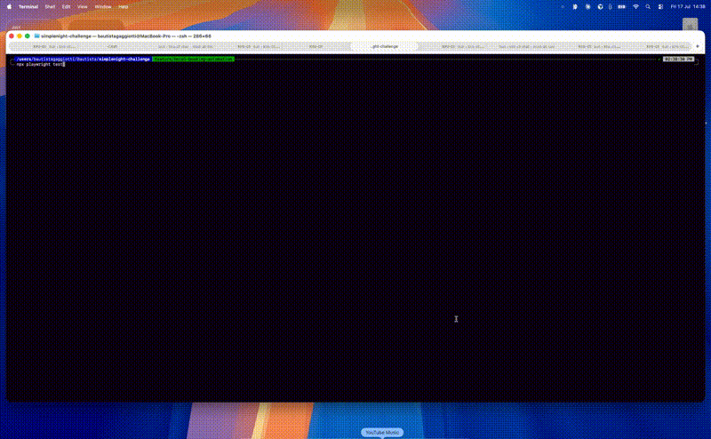

# simplenight-challenge

Playwright + TypeScript test automation framework for Simplenight's hotel booking flow.



## Setup

```bash
npm install
npx playwright install chromium
```

## Running Tests

```bash
npm test              # Default (headed, staging)
npm run test:debug    # Step-through debug mode
npm run test:ui       # Playwright UI mode
npm run report        # View last HTML report
```

## Test Scope (HTL-001)

1. Navigate to homepage → Select Hotels
2. Search: Miami · Aug 1–3 · 1 Adult + 1 Child (age 8)
3. Switch to Map view
4. Filter: Price $100–$1,000+ · Guest Score "Very Good (7+)"
5. Zoom in on map, select 1 hotel marker
6. Assert: Price ≥ $100 and Guest Score ≥ 7.0

## Project Structure

```
├── flows/hotel_flow.ts          # Orchestrates the full booking flow
├── pages/
│   ├── home_page.ts             # Category navigation
│   ├── search_page.ts           # Location, dates, guests
│   ├── results_page.ts          # Map view, filters, zoom, markers
│   └── hotel_card_page.ts       # Price & score assertions
├── fixtures/page_fixtures.ts    # test.extend DI wiring
├── test_data/hotels.ts          # Typed search config (HotelSearchConfig)
├── tests/hotels/hotel_booking.spec.ts
├── env/.env.staging             # Environment params
└── playwright.config.ts         # Reads from .env
```

## Architecture

**Pages** — locators declared at top, methods use them. No stored state.

**Flows** — orchestrate page objects into user journeys. Accept typed config, use `test.step` for traceability.

**Test** — calls the flow, then asserts:
```ts
await hotelFlow.searchAndFilterOnMap(hotelTestData);
await hotelFlow.hotelCardPage.assertPriceWithinRange(filters.priceMin, filters.priceMax);
await hotelFlow.hotelCardPage.assertGuestScoreAbove(filters.guestScoreMinValue);
```

## Adding a New Category

1. `test_data/car_rental.ts` — define config interface + data
2. `pages/car_rental_search_page.ts` — form interactions
3. `flows/car_rental_flow.ts` — orchestrate the flow
4. `fixtures/page_fixtures.ts` — add fixture
5. `tests/car_rental/car_rental.spec.ts` — call flow + assert

`HomePage.selectCategory('Car Rental')` works for any category out of the box.

## Environment Config

```env
# env/.env.staging
BASE_URL=https://wl.stg.simplenight.com/
WORKERS=1
RETRIES=1
TIMEOUT=120000
HEADLESS=false
```

Switch environments: `ENV=production npm test`

## Key Patterns

- **Locators**: `getByRole`, `getByLabel`, `getByTestId` — resilient, no CSS/XPath
- **Waits**: `waitForResponse(/poll/)`, `waitForFunction`, `waitFor` — no hard sleeps except Google Maps scroll animation (200ms between zoom events)
- **Assertions**: web-first with descriptive failure messages
- **Map interaction**: Ctrl+scroll zoom, `waitForFunction` for marker detection, role-based marker selection

## AI Tools Used

Built with **Kiro CLI (Claude)** + **Playwright MCP server**:

- **Playwright MCP** navigated the live staging site to discover and verify every locator against the actual accessibility tree.
- **Playwright CLI Skill** (`.claude/skills/playwright-cli`) — official Microsoft skill providing the agent with structured reference docs on Playwright capabilities (test running, mocking, tracing, code execution).
- **Kiro CLI** assisted with code generation, debugging (strict mode violations, shadow DOM, networkidle hangs), and iterative refinement.
- **Sub-agent reviewer** — a QA Lead reviewer agent independently audited the project (read code, compiled, ran tests, scored). Its feedback drove improvements (removed `networkidle`, added `test.step`, replaced sleeps with `waitForResponse`/`waitForFunction`).
- **Quality control**: Every change compiled and tested. Final test passed 20/20 consecutive runs with zero retries.
